### Hello 👋

I'm working at the intersection of security, and technology. I share projects on Github since 2012, you can find more context for many of the repositories hosted here on my [personal blog](https://BHDicaire.com/en/). You can also browse all the projects I've found interesting by looking at what I've [starred](https://github.com/BHDicaire?tab=stars). 

By the way, my last name is pronounced “de-care”.

# Benoît H. Dicaire

I work at the intersection of security, infrastructure, and technology. My last name is pronounced *"de-care"*.

## Stats & Activity

---

## Starred Topics

---

## Achievements

---

## Recent Activity

---

Metrics auto-generated daily by [lowlighter/metrics](https://github.com/lowlighter/metrics).